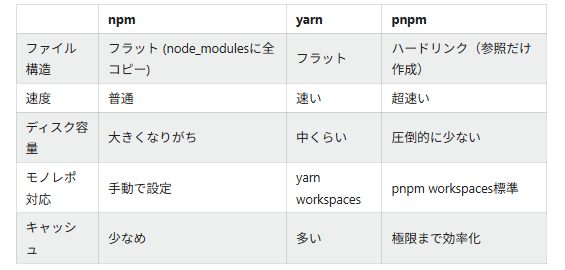

# 目的
chat機能を作成する過程でNext.jsに触れ、基本的な仕組みを理解すること  
<!-- [参考サイト](https://zenn.dev/umi_mori/books/next-js-typescript/viewer/setting-up-the-environment)を見ながら作成した   -->
<br/>

# 機能
- メッセージの送信
- チャットログの表示
- API経由でデータ取得や登録  
<br/>

# 開発環境
- TypeScript
- Next.js 14.2.35  
┗　フレームワーク
- Node.js  v24.12.0  
┗　実行環境
- pnpm 10.28.0  
┗　パッケージ管理
- Recoil 0.7.7  
┗　チャット状態管理（メッセージ、入力値）
- Material UI
- React 18.2.0  
┗　UIコンポーメント
- Vercel  
┗　デプロイに使用
- Git/GitHub  
┗　repository：https://github.com/ykpn10-sv/nextjs_chat_learning.git  
<br/>


<!-- 

This is a [Next.js](https://nextjs.org) project bootstrapped with [`create-next-app`](https://nextjs.org/docs/app/api-reference/cli/create-next-app). -->

# 開発サーバーの起動コマンド
<br/>

### サーバー起動方法

```bash
pnpm dev
```
<br/>

### pnpmについて
- ### pnpmとは  
    pnpm（Performant npm） は、Node.jsのパッケージマネージャーの一つ。  
    npmやyarnと同じ「依存関係管理ツール」ですが、圧倒的に速く、ディスク使用量が少ないのが特徴

- ### npm/yarnとの違い
    
    - [参考サイト](https://qiita.com/yamapiiii/items/285781ce58bac7731388) はこちら  
    <br/>

# 開発手順

**Node.jsのインストール**  
↓     
**pnpmのインストール**  
↓  
**Next.jsのプロジェクト作成**  
    ┗セットアップ  
↓
**開発環境の起動**  
↓  
**コンポーネントの作成**  
↓  
**APIの作成**  
↓  
**vercelにデプロイ**  


<br/>
<br/>
<br/>

# **ーーーーー編集中（追記あり）ーーーーー**


<!-- 
Open [http://localhost:3000](http://localhost:3000) with your browser to see the result.

You can start editing the page by modifying `app/page.tsx`. The page auto-updates as you edit the file.

This project uses [`next/font`](https://nextjs.org/docs/app/building-your-application/optimizing/fonts) to automatically optimize and load [Geist](https://vercel.com/font), a new font family for Vercel.

## Learn More

To learn more about Next.js, take a look at the following resources:

- [Next.js Documentation](https://nextjs.org/docs) - learn about Next.js features and API.
- [Learn Next.js](https://nextjs.org/learn) - an interactive Next.js tutorial.

You can check out [the Next.js GitHub repository](https://github.com/vercel/next.js) - your feedback and contributions are welcome!

## Deploy on Vercel

The easiest way to deploy your Next.js app is to use the [Vercel Platform](https://vercel.com/new?utm_medium=default-template&filter=next.js&utm_source=create-next-app&utm_campaign=create-next-app-readme) from the creators of Next.js.

Check out our [Next.js deployment documentation](https://nextjs.org/docs/app/building-your-application/deploying) for more details. -->
